# Execution Plan

테이블오더 서비스 개발을 위한 단계별 실행 계획입니다.

---

## Detailed Analysis Summary

### Project Context
- **Project Type**: Greenfield (새 프로젝트)
- **Request**: 테이블오더 서비스 구축 - 고객용 주문 UI + 관리자용 관리 UI + 백엔드 API + 데이터베이스
- **Technology Stack**: React + Python FastAPI + SQLite
- **Key Features**: 실시간 주문 모니터링(SSE), 자동 로그인, 장바구니, 메뉴 관리

### Change Impact Assessment

**User-facing changes**: Yes
- 고객용 주문 인터페이스 전체
- 관리자용 관리 인터페이스 전체
- 직관적 UI/UX 필요

**Structural changes**: Yes
- 새로운 시스템 아키텍처 설계
- 프론트엔드-백엔드 분리 구조
- 컴포넌트 기반 설계

**Data model changes**: Yes
- 8개 엔티티 (Store, Table, TableSession, Admin, MenuCategory, Menu, Order, OrderItem, OrderHistory)
- 관계형 데이터베이스 스키마 설계
- 세션 관리 및 주문 이력 처리

**API changes**: Yes
- RESTful API 전체 설계 및 구현
- SSE 엔드포인트 (실시간 주문 스트림)
- 20+ API 엔드포인트

**NFR impact**: Yes
- 성능: 메뉴 로딩 1초, 주문 2초, 실시간 업데이트 2초
- 보안: JWT 인증, bcrypt, HTTP-only Cookie, 로그인 제한
- 확장성: 최대 50개 테이블, 100건/분 주문
- 사용성: 터치 친화적 UI (44x44px 최소 버튼)

### Risk Assessment

**Risk Level**: Medium
- 새 프로젝트이지만 요구사항이 명확함
- 실시간 SSE 구현이 기술적 챌린지
- 다중 세션 관리 로직이 복잡할 수 있음
- 프론트엔드-백엔드 통합 테스트 필요

**Rollback Complexity**: Easy
- Greenfield 프로젝트로 롤백 이슈 없음
- 로컬 개발 환경

**Testing Complexity**: Moderate
- 단위 테스트 + 통합 테스트
- SSE 실시간 업데이트 테스트 필요
- 세션 관리 시나리오 테스트

---

## Workflow Visualization

```mermaid
flowchart TD
    Start(["User Request"])
    
    subgraph INCEPTION["🔵 INCEPTION PHASE"]
        WD["Workspace Detection<br/><b>COMPLETED</b>"]
        RA["Requirements Analysis<br/><b>COMPLETED</b>"]
        US["User Stories<br/><b>COMPLETED</b>"]
        WP["Workflow Planning<br/><b>IN PROGRESS</b>"]
        AD["Application Design<br/><b>EXECUTE</b>"]
        UG["Units Generation<br/><b>EXECUTE</b>"]
    end
    
    subgraph CONSTRUCTION["🟢 CONSTRUCTION PHASE"]
        direction TB
        PerUnit["Per-Unit Loop<br/>(For Each Unit)"]
        FD["Functional Design<br/><b>EXECUTE</b>"]
        NFRA["NFR Requirements<br/><b>EXECUTE</b>"]
        NFRD["NFR Design<br/><b>EXECUTE</b>"]
        ID["Infrastructure Design<br/><b>SKIP</b>"]
        CG["Code Generation<br/><b>EXECUTE</b>"]
        BT["Build and Test<br/><b>EXECUTE</b>"]
    end
    
    subgraph OPERATIONS["🟡 OPERATIONS PHASE"]
        OPS["Operations<br/><b>PLACEHOLDER</b>"]
    end
    
    Start --> WD
    WD --> RA
    RA --> US
    US --> WP
    WP --> AD
    AD --> UG
    UG --> PerUnit
    PerUnit --> FD
    FD --> NFRA
    NFRA --> NFRD
    NFRD --> ID
    ID --> CG
    CG -.->|Next Unit| FD
    CG --> BT
    BT --> End(["Complete"])
    
    style WD fill:#4CAF50,stroke:#1B5E20,stroke-width:3px,color:#fff
    style RA fill:#4CAF50,stroke:#1B5E20,stroke-width:3px,color:#fff
    style US fill:#4CAF50,stroke:#1B5E20,stroke-width:3px,color:#fff
    style WP fill:#4CAF50,stroke:#1B5E20,stroke-width:3px,color:#fff
    style AD fill:#FFA726,stroke:#E65100,stroke-width:3px,stroke-dasharray: 5 5,color:#000
    style UG fill:#FFA726,stroke:#E65100,stroke-width:3px,stroke-dasharray: 5 5,color:#000
    style FD fill:#FFA726,stroke:#E65100,stroke-width:3px,stroke-dasharray: 5 5,color:#000
    style NFRA fill:#FFA726,stroke:#E65100,stroke-width:3px,stroke-dasharray: 5 5,color:#000
    style NFRD fill:#FFA726,stroke:#E65100,stroke-width:3px,stroke-dasharray: 5 5,color:#000
    style ID fill:#BDBDBD,stroke:#424242,stroke-width:2px,stroke-dasharray: 5 5,color:#000
    style CG fill:#4CAF50,stroke:#1B5E20,stroke-width:3px,color:#fff
    style BT fill:#4CAF50,stroke:#1B5E20,stroke-width:3px,color:#fff
    style OPS fill:#BDBDBD,stroke:#424242,stroke-width:2px,stroke-dasharray: 5 5,color:#000
    style PerUnit fill:#81C784,stroke:#2E7D32,stroke-width:2px,color:#000
    style Start fill:#CE93D8,stroke:#6A1B9A,stroke-width:3px,color:#000
    style End fill:#CE93D8,stroke:#6A1B9A,stroke-width:3px,color:#000
    style INCEPTION fill:#BBDEFB,stroke:#1565C0,stroke-width:3px,color:#000
    style CONSTRUCTION fill:#C8E6C9,stroke:#2E7D32,stroke-width:3px,color:#000
    style OPERATIONS fill:#FFF59D,stroke:#F57F17,stroke-width:3px,color:#000
    
    linkStyle default stroke:#333,stroke-width:2px
```

---

## Phases to Execute

### 🔵 INCEPTION PHASE

#### Completed Stages
- [x] **Workspace Detection** - COMPLETED
  - Greenfield 프로젝트 확인
  - 작업공간 루트 설정

- [x] **Requirements Analysis** - COMPLETED
  - 요구사항 명세 완료
  - 기술 스택 결정 (React, FastAPI, SQLite)
  - 12개 명확화 질문 답변
  - MVP 범위 정의

- [x] **User Stories** - COMPLETED
  - 2개 페르소나 생성 (고객, 관리자)
  - 20개 User Stories 생성 (Must Have 17개, Should Have 3개)
  - 2개 Epic (테이블 관리, 메뉴 관리)
  - INVEST 기준 준수

- [x] **Workflow Planning** - IN PROGRESS
  - 실행 계획 수립 중

#### Stages to Execute

- [ ] **Application Design** - EXECUTE
  - **Rationale**: 새로운 시스템 설계 필요
  - **Deliverables**:
    - 컴포넌트 식별 및 정의 (프론트엔드 + 백엔드)
    - 서비스 레이어 설계
    - 컴포넌트 간 상호작용
    - API 계약 정의
  - **Why**: 
    - 고객 UI, 관리자 UI, 백엔드 API의 명확한 경계 필요
    - 20+ API 엔드포인트 설계
    - SSE 실시간 통신 아키텍처
    - 세션 관리 및 주문 플로우 설계

- [ ] **Units Generation** - EXECUTE
  - **Rationale**: 복잡한 시스템을 관리 가능한 단위로 분해
  - **Deliverables**:
    - 개발 단위(유닛) 정의
    - 유닛 간 의존성 매핑
    - 개발 순서 결정
  - **Why**:
    - 프론트엔드와 백엔드는 병렬 개발 가능
    - 데이터베이스 스키마는 먼저 완성 필요
    - 고객 UI와 관리자 UI는 독립적 개발 가능
  - **Expected Units**:
    - Unit 1: 데이터베이스 및 백엔드 API (우선)
    - Unit 2: 고객용 프론트엔드
    - Unit 3: 관리자용 프론트엔드

---

### 🟢 CONSTRUCTION PHASE

각 유닛마다 다음 단계들을 순차적으로 수행합니다.

#### Per-Unit Design Stages

- [ ] **Functional Design** - EXECUTE (per-unit)
  - **Rationale**: 복잡한 비즈니스 로직 설계 필요
  - **Deliverables**:
    - 데이터 모델 상세 설계 (8개 엔티티)
    - 비즈니스 규칙 정의
    - 상태 머신 (주문 상태, 세션 상태)
    - 엣지 케이스 처리
  - **Why**:
    - 테이블 세션 라이프사이클이 복잡함
    - 주문 상태 관리 (대기중/준비중/완료)
    - 과거 이력 아카이빙 로직
    - 장바구니 동기화 및 주문 생성 플로우

- [ ] **NFR Requirements** - EXECUTE (per-unit)
  - **Rationale**: 명확한 NFR 요구사항 존재
  - **Deliverables**:
    - 성능 목표 (메뉴 1초, 주문 2초, 실시간 2초)
    - 보안 요구사항 (JWT, bcrypt, Cookie)
    - 확장성 목표 (50 테이블, 100건/분)
    - 사용성 기준 (44x44px 버튼)
  - **Why**:
    - SSE 실시간 업데이트 성능 critical
    - 세션 관리 보안 중요
    - 터치 UI 사용성 기준

- [ ] **NFR Design** - EXECUTE (per-unit)
  - **Rationale**: NFR Requirements가 실행되므로 설계 필요
  - **Deliverables**:
    - SSE 구현 패턴
    - JWT 인증 플로우
    - 성능 최적화 전략
    - 에러 처리 패턴
  - **Why**:
    - SSE를 FastAPI에서 구현하는 구체적 방법
    - HTTP-only Cookie 설정
    - React에서 SSE 수신 및 UI 업데이트
    - 장바구니 LocalStorage 동기화

- [ ] **Infrastructure Design** - SKIP (per-unit)
  - **Rationale**: 로컬 개발 환경, 복잡한 인프라 없음
  - **Why Skip**:
    - SQLite 파일 기반 데이터베이스
    - 로컬 서버 배포
    - 클라우드 리소스 없음
    - .env 파일로 간단한 설정

#### Code Generation (Always Execute)

- [ ] **Code Generation** - EXECUTE (per-unit, ALWAYS)
  - **Rationale**: 실제 코드 구현 필요
  - **Two Parts**:
    - Part 1: 코드 생성 계획 수립 (체크리스트)
    - Part 2: 계획 실행 및 코드 작성
  - **Deliverables**:
    - 프론트엔드 코드 (React 컴포넌트)
    - 백엔드 코드 (FastAPI 라우트, 서비스, 모델)
    - 데이터베이스 마이그레이션 (Alembic)
    - 시드 데이터 스크립트
    - 단위 테스트 코드

#### Build and Test (Always Execute)

- [ ] **Build and Test** - EXECUTE (ALWAYS)
  - **Rationale**: 모든 유닛 완성 후 통합 및 검증
  - **Deliverables**:
    - 빌드 지침서 (build-instructions.md)
    - 단위 테스트 지침서 (unit-test-instructions.md)
    - 통합 테스트 지침서 (integration-test-instructions.md)
    - 빌드 및 테스트 요약 (build-and-test-summary.md)
  - **Why**:
    - 전체 시스템 빌드 검증
    - 프론트엔드-백엔드 통합 테스트
    - SSE 실시간 통신 테스트
    - 세션 관리 시나리오 테스트

---

### 🟡 OPERATIONS PHASE

- [ ] **Operations** - PLACEHOLDER
  - **Rationale**: 향후 배포 및 모니터링 워크플로우를 위한 플레이스홀더
  - **Current State**: 빌드 및 테스트는 CONSTRUCTION 단계에서 처리

---

## Execution Summary

### Stages to Execute (Total: 8)

**INCEPTION (2 stages)**:
1. Application Design
2. Units Generation

**CONSTRUCTION (6 stages per unit, 3 units)**:
1. Functional Design (per-unit)
2. NFR Requirements (per-unit)
3. NFR Design (per-unit)
4. Code Generation (per-unit) - ALWAYS
5. Build and Test (once) - ALWAYS

**Total estimated stages**: 2 (Inception) + 4×3 (per-unit) + 1 (Build & Test) = **15 stages**

### Stages to Skip (Total: 2)

**INCEPTION**: None

**CONSTRUCTION (1 stage per unit)**:
1. Infrastructure Design (per-unit) - 로컬 환경, 복잡한 인프라 없음

**Total skipped stages**: 1×3 = **3 stages**

---

## Unit Development Sequence

### Unit 1: 데이터베이스 및 백엔드 API (우선순위: 1)
**개발 기간**: 약 1-2주

**범위**:
- SQLite 데이터베이스 스키마 생성 (8개 테이블)
- FastAPI 애플리케이션 구조
- 20+ RESTful API 엔드포인트
- SSE 실시간 주문 스트림
- JWT 인증 및 세션 관리
- 비즈니스 로직 (주문, 테이블 세션, 메뉴 관리)
- 시드 데이터 스크립트
- 백엔드 단위 테스트

**왜 먼저?**: 
- 프론트엔드는 API에 의존함
- 데이터 모델이 모든 것의 기초
- API 계약이 확정되어야 프론트엔드 개발 시작 가능

**의존성**: 없음 (첫 번째 유닛)

---

### Unit 2: 고객용 프론트엔드 (우선순위: 2)
**개발 기간**: 약 1주

**범위**:
- React 애플리케이션 (고객용)
- 자동 로그인 컴포넌트
- 메뉴 조회 및 카테고리 탐색
- 장바구니 관리 (LocalStorage)
- 주문 생성 및 내역 조회
- 터치 친화적 UI
- 고객 UI 단위 테스트

**의존성**: Unit 1 (백엔드 API 완성 필요)

---

### Unit 3: 관리자용 프론트엔드 (우선순위: 3)
**개발 기간**: 약 1주

**범위**:
- React 애플리케이션 (관리자용)
- 관리자 로그인
- 실시간 주문 대시보드 (SSE 수신)
- 주문 상태 변경
- 테이블 관리 (초기 설정, 주문 삭제, 세션 종료, 과거 내역)
- 메뉴 관리 (CRUD)
- 관리자 UI 단위 테스트

**의존성**: Unit 1 (백엔드 API, 특히 SSE 엔드포인트 필요)

**병렬 가능**: Unit 2와 병렬 개발 가능 (API가 준비되면)

---

## Integration and Testing

### Build and Test (Final Stage)
**개발 기간**: 약 3-5일

**활동**:
1. 전체 시스템 빌드 검증
2. 프론트엔드-백엔드 통합 테스트
3. SSE 실시간 통신 End-to-End 테스트
4. 세션 관리 시나리오 테스트 (다중 테이블)
5. 주문 플로우 통합 테스트 (고객 주문 → 관리자 수신 → 상태 변경)
6. 성능 테스트 (메뉴 로딩, 주문 응답 시간)
7. 빌드 및 테스트 지침서 작성

---

## Estimated Timeline

**Total Duration**: 약 4-5주

- **INCEPTION**: 3-5일
  - Application Design: 1-2일
  - Units Generation: 1일

- **CONSTRUCTION**: 3-4주
  - Unit 1 (Backend): 1-2주
  - Unit 2 (Customer UI): 1주 (Unit 1 완성 후)
  - Unit 3 (Admin UI): 1주 (Unit 1 완성 후, Unit 2와 병렬 가능)
  - Build and Test: 3-5일

- **OPERATIONS**: Placeholder (현재 범위 외)

---

## Success Criteria

### Primary Goal
테이블오더 MVP 서비스를 완성하여 고객이 태블릿으로 주문하고, 관리자가 실시간으로 주문을 관리할 수 있는 시스템 구축

### Key Deliverables
- ✅ 작동하는 고객용 주문 UI (8개 User Stories 구현)
- ✅ 작동하는 관리자용 관리 UI (11개 User Stories 구현)
- ✅ 안정적인 백엔드 API (20+ 엔드포인트)
- ✅ 실시간 주문 업데이트 (SSE)
- ✅ 데이터베이스 및 시드 데이터
- ✅ 단위 테스트 및 통합 테스트
- ✅ 빌드 및 테스트 지침서

### Quality Gates
- **Functionality**: 모든 MVP User Stories 구현 완료
- **Performance**: 메뉴 1초, 주문 2초, 실시간 2초 이내
- **Security**: JWT 인증, bcrypt 해싱, HTTP-only Cookie 구현
- **Usability**: 터치 친화적 UI (44x44px 버튼)
- **Testing**: 단위 테스트 통과율 80% 이상
- **Integration**: 고객-백엔드-관리자 전체 플로우 작동

---

## Risk Mitigation

### Identified Risks
1. **SSE 실시간 업데이트 복잡도**
   - Mitigation: NFR Design 단계에서 구체적 구현 패턴 정의
   - Mitigation: 통합 테스트에서 SSE 시나리오 검증

2. **세션 관리 로직 복잡도**
   - Mitigation: Functional Design 단계에서 상태 머신 명확히 정의
   - Mitigation: 엣지 케이스 시나리오 테스트

3. **프론트엔드-백엔드 통합**
   - Mitigation: Application Design 단계에서 API 계약 명확히 정의
   - Mitigation: Build and Test 단계에서 통합 테스트 수행

4. **성능 목표 달성**
   - Mitigation: NFR Design 단계에서 최적화 전략 수립
   - Mitigation: 성능 테스트로 검증

---

## Next Steps

1. ✅ 사용자 승인 대기
2. ➡️ Application Design 시작
3. ➡️ Units Generation 시작
4. ➡️ Unit 1 (Backend) 개발 시작
5. ➡️ Unit 2, 3 (Frontend) 개발 진행
6. ➡️ Build and Test 최종 검증
